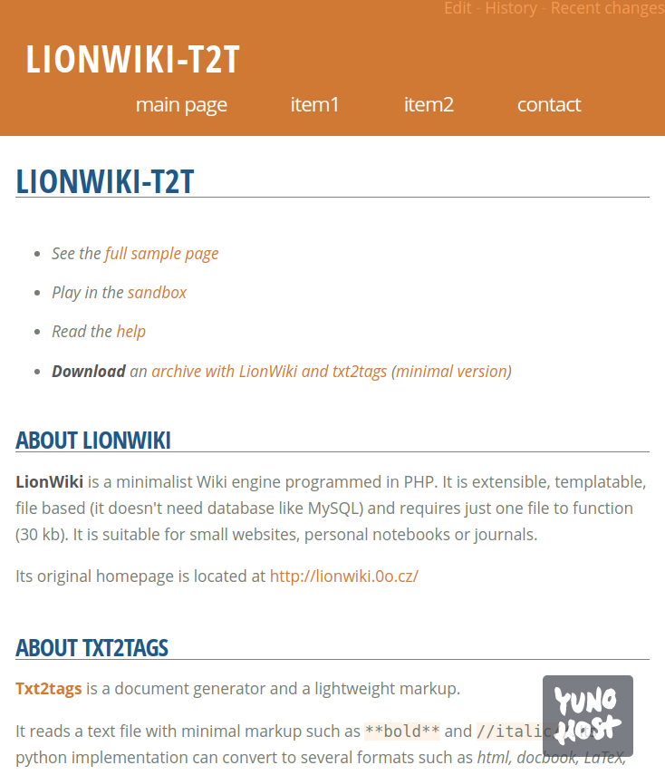

<!--
Ohart ongi: README hau automatikoki sortu da <https://github.com/YunoHost/apps/tree/master/tools/readme_generator>ri esker
EZ editatu eskuz.
-->

# Lionwiki YunoHost-erako

[](https://ci-apps.yunohost.org/ci/apps/lionwiki-t2t/)  

[](https://install-app.yunohost.org/?app=lionwiki-t2t)

*[Irakurri README hau beste hizkuntzatan.](./ALL_README.md)*

> *Pakete honek Lionwiki YunoHost zerbitzari batean azkar eta zailtasunik gabe instalatzea ahalbidetzen dizu.*  
> *YunoHost ez baduzu, kontsultatu [gida](https://yunohost.org/install) nola instalatu ikasteko.*

## Aurreikuspena

LionWiki-t2t is a minimalist Wiki engine programmed in PHP. It is extensible, templatable, file based (it doesn't need database like MySQL) and requires just one file to function (30 kb). It is suitable for small websites, personal notebooks or journals. This version is using the lightweight markup language TXT2TAGS.


**Paketatutako bertsioa:** 2024.07.04~ynh1

## Pantaila-argazkiak



## Dokumentazioa eta baliabideak

- Aplikazioaren webgune ofiziala: <https://lionwiki-t2t.sourceforge.io/>
- Erabiltzaileen dokumentazio ofiziala: <https://github.com/farvardin/whatistxt2tags>
- Administratzaileen dokumentazio ofiziala: <https://lionwiki-t2t.sourceforge.io/>
- Jatorrizko aplikazioaren kode-gordailua: <https://sourceforge.net/projects/lionwiki-t2t>
- YunoHost Denda: <https://apps.yunohost.org/app/lionwiki-t2t>
- Eman errore baten berri: <https://github.com/YunoHost-Apps/lionwiki-t2t_ynh/issues>

## Garatzaileentzako informazioa

Bidali `pull request`a [`testing` abarrera](https://github.com/YunoHost-Apps/lionwiki-t2t_ynh/tree/testing).

`testing` abarra probatzeko, ondorengoa egin:

```bash
sudo yunohost app install https://github.com/YunoHost-Apps/lionwiki-t2t_ynh/tree/testing --debug
edo
sudo yunohost app upgrade lionwiki-t2t -u https://github.com/YunoHost-Apps/lionwiki-t2t_ynh/tree/testing --debug
```

**Informazio gehiago aplikazioaren paketatzeari buruz:** <https://yunohost.org/packaging_apps>
