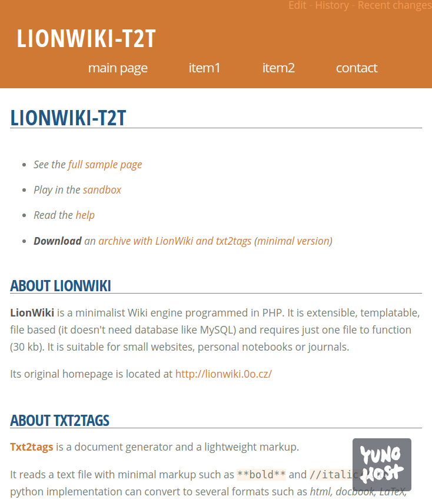

# Lionwiki-t2t pour YunoHost


*[Read this readme in english.](./README.md)* 

> *Ce package vous permet d'installer Lionwiki-t2t rapidement et simplement sur un serveur Yunohost.  
Si vous n'avez pas YunoHost, regardez [ici](https://yunohost.org/#/install) pour savoir comment l'installer et en profiter.*

## Vue d'ensemble

Lionwiki-t2t est un système de type wiki minimaliste, programmé en PHP. Il est extensible et n'utilise que des fichiers plats pour sa base de données. Il est adapté pour la création de petits sites web, de notes personnelles ou de journaux. Cette version utilise le langage de balisage léger TXT2TAGS.


## Capture d'écran




## Configuration

Dans le dossier racine de l'application il y a 2 fichiers, config.php et config.t2t

- config.php permet de modifier le mot de passe, le choix du template utilisé et la page par défaut. Vous pouvez également définir ici un mot de passe administrateur (pour bloquer certaines pages en édition)

- config.t2t est pour customiser votre syntaxe wiki. Vous pouvez définir là de nouvelles balises (utilisant les règles txt2tags) pour des comportements spécifiques.


## Documentation

 * Documentation officielle: https://github.com/farvardin/lionwiki-t2t
 * À propos de txt2tags: https://github.com/farvardin/whatistxt2tags

## Caractéristiques spécifiques YunoHost

#### Support multi-utilisateurs

Il y a un seul mot de passe pour éditer ce wiki (dans le fichier config.php), et un autre pour l'administration. C'est le même qui a a été créé lors de l'installation par YunoHost.

Vous pouvez passer le wiki en mode privé ou public, selon vos usages.


#### Architectures supportées

* Toutes, cela utilise PHP.

## Limitations

* Un seul compte utilisateur. Configuration seulement par fichier éditable en ssh.

## Informations additionnelles

Vous devez définir une couleur de base durant l'installation, au format hexadécimal. Vous pouvez la choisir en utilisant cet outil en ligne : https://www.w3schools.com/colors/colors_picker.asp

La couleur choisie va modifier le fichier templates/minimaxing/minimaxing.less et le compiler en utilisant la commande lessc (du paquet node-less).

Après l'installation, vous pouvez éditer la couleur de base dans le fichier /var/www/lionwikit2t/templates/minimaxing/minimaxing.less 

Recherchez pour :

```
/* For YunoHost config */
@MainColor: #D17732;
```

Allez dans le dossier d'installation (à adapter à votre cas, si c'est la seconde instance installée, cela sera nommé /var/www/lionwikit2t__2/):

```
cd /var/www/lionwikit2t
```

Ensuite compilez le fichier avec :

```
lessc templates/minimaxing/minimaxing.less > templates/minimaxing/minimaxing.css
```

Si quelque chose se passe mal, vous pouvez revenir au fichier original :

```
cp templates/minimaxing/minimaxing_org.css templates/minimaxing/minimaxing.css
```

## Licence

Licence MIT


## Liens

 * Signaler un bug: https://github.com/farvardin/lionwiki-t2t_ynh/issues
 * Site de l'application: https://github.com/farvardin/lionwiki-t2t
 * Site web YunoHost: https://yunohost.org/


