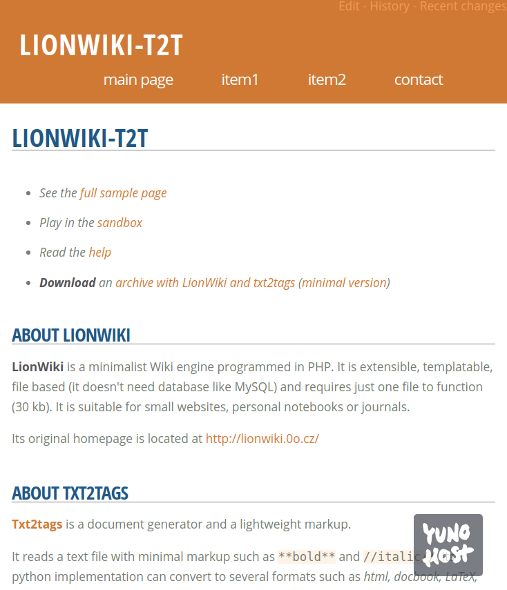

<!--
N.B.: README ini dibuat secara otomatis oleh <https://github.com/YunoHost/apps/tree/master/tools/readme_generator>
Ini TIDAK boleh diedit dengan tangan.
-->

# Lionwiki untuk YunoHost

[](https://ci-apps.yunohost.org/ci/apps/lionwiki-t2t/)


[](https://install-app.yunohost.org/?app=lionwiki-t2t)

*[Baca README ini dengan bahasa yang lain.](./ALL_README.md)*

> *Paket ini memperbolehkan Anda untuk memasang Lionwiki secara cepat dan mudah pada server YunoHost.*  
> *Bila Anda tidak mempunyai YunoHost, silakan berkonsultasi dengan [panduan](https://yunohost.org/install) untuk mempelajari bagaimana untuk memasangnya.*

## Ringkasan

LionWiki is a minimalist Wiki engine programmed in PHP. It is extensible, templatable, file based (it doesn't need database like MySQL) and requires just one file to function (30 kb). It is suitable for small websites, personal notebooks or journals. This version is using the lightweight markup language TXT2TAGS.


**Versi terkirim:** 2025.03.30~ynh1

## Tangkapan Layar



## Dokumentasi dan sumber daya

- Website aplikasi resmi: <https://lionwiki-t2t.sourceforge.io/>
- Dokumentasi pengguna resmi: <https://github.com/farvardin/whatistxt2tags>
- Dokumentasi admin resmi: <https://lionwiki-t2t.sourceforge.io/>
- Depot kode aplikasi hulu: <https://sourceforge.net/projects/lionwiki-t2t>
- Gudang YunoHost: <https://apps.yunohost.org/app/lionwiki-t2t>
- Laporkan bug: <https://github.com/YunoHost-Apps/lionwiki-t2t_ynh/issues>

## Info developer

Silakan kirim pull request ke [`testing` branch](https://github.com/YunoHost-Apps/lionwiki-t2t_ynh/tree/testing).

Untuk mencoba branch `testing`, silakan dilanjutkan seperti:

```bash
sudo yunohost app install https://github.com/YunoHost-Apps/lionwiki-t2t_ynh/tree/testing --debug
atau
sudo yunohost app upgrade lionwiki-t2t -u https://github.com/YunoHost-Apps/lionwiki-t2t_ynh/tree/testing --debug
```

**Info lebih lanjut mengenai pemaketan aplikasi:** <https://yunohost.org/packaging_apps>
